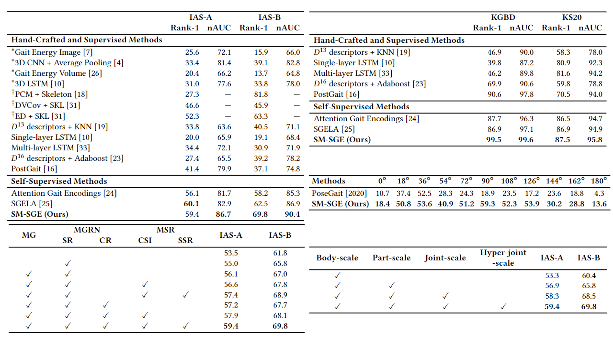

# SM-SGE: A Self-Supervised Multi-Scale Skeleton Graph Encoding Framework for Person Re-Identification
By Haocong Rao, Shihao Xu, Xiping Hu, Jun Cheng, Bin Hu. In [ACMMM 2021](https://arxiv.org/pdf/2107.01903).

## Introduction
This is the official implementation of SM-SGE framework presented by "SM-SGE: A Self-Supervised Multi-Scale Skeleton Graph Encoding Framework for Person Re-Identification". The codes are used to reproduce experimental results in the [**paper**](https://arxiv.org/pdf/2107.01903).


Abstract: Person re-identification via 3D skeletons is an emerging topic with great potential in security-critical applications. Existing methods typically learn body and motion features from the body-joint trajectory, whereas they lack a systematic way to model body structure and underlying relations of body components beyond the scale of body joints. In this paper, we for the first time propose a Self-supervised Multi-scale Skeleton Graph Encoding (SM-SGE) framework that comprehensively models human body, component relations, and skeleton dynamics from unlabeled skeleton graphs of various scales to learn an effective skeleton representation for person Re-ID. Specifically, we first devise multi-scale skeleton graphs with coarse-to-fine human body partitions, which enables us to model body structure and skeleton dynamics at multiple levels. Second, to mine inherent correlations between body components in skeletal motion, we propose a multi-scale graph relation network to learn structural relations between adjacent body-component nodes and collaborative relations among nodes of different scales, so as to capture more discriminative skeleton graph features. Last, we propose a novel multi-scale skeleton reconstruction mechanism to enable our framework to encode skeleton dynamics and high-level semantics from unlabeled skeleton graphs, which encourages learning a discriminative skeleton representation for person Re-ID. Extensive experiments show that SM-SGE outperforms most state-of-the-art skeleton-based methods. 
We further demonstrate its effectiveness on 3D skeleton data estimated from large-scale RGB videos.

## Requirements
- Python 3.5
- Tensorflow 1.10.0 (GPU)

## Datasets and Models
We provide two already pre-processed datasets (IAS-Lab, KGBD) with various sequence lengths on <br/>
https://pan.baidu.com/s/1nuFH2EENyrMZbTnKGYssTw  &nbsp; &nbsp; &nbsp; password：&nbsp;  hyo7  <br/>

Note: The access to the Vislab Multi-view KS20 dataset is available upon request. If you have signed the license agreement and been granted the right to use it, please contact me and I will share the pre-processed KS20 data.

All the best models reported in our paper can be acquired on <br/> 
https://pan.baidu.com/s/1AIn7Iyfn7B-w2Eh3ZfHIZA &nbsp; &nbsp; &nbsp; password：&nbsp; sd4v  <br/> 
Please download the pre-processed datasets ``Datasets/`` and model files ``RN/`` into the current directory. <br/>

We also provide the pre-trained multi-scale skeleton graph encoding models on <br/> 
https://pan.baidu.com/s/1ergZ7oJyo6fDkF2WGDNL9A &nbsp; &nbsp; &nbsp; password：&nbsp; vx48  <br/> 
Please download the pre-trained graph encoding models into the directory ``Pre-Trained/``. 
<br/>

The original datasets can be downloaded here: [IAS-Lab](http://robotics.dei.unipd.it/reid/index.php/downloads), [KGBD](https://www.researchgate.net/publication/275023745_Kinect_Gait_Biometry_Dataset_-_data_from_164_individuals_walking_in_front_of_a_X-Box_360_Kinect_Sensor), [KS20.](http://vislab.isr.ist.utl.pt/datasets/#ks20) <br/> 

 
 
## Usage

To (1) train the SM-SGE framework to obtain skeleton representations and (2) validate their effectiveness on the downstream task of person Re-ID on a specific dataset, simply run the following command:  

```bash
python SM-SGE.py --dataset KS20

# Default options: --dataset KS20 --split '' --length 6 --fusion_lambda 1 --P 8 --sample_num 1 --pre_train 1 --save_flag 1 --gpu 0
# --dataset [IAS, KGBD, KS20]
# --split ['', 'A' (for IAS-A), 'B' (for IAS-B)] 
# --length [4, 6, 8, 10] 
# --pre_train ['1' (train from scratch), '0' (reload pre-trained model)] 
# --save_flag ['1' (save MLP models), '0' (do not save MLP models)]
# --gpu [0, 1, ...]

```
Please see ```SM-SGE.py``` for more details.

To print evaluation results (Re-ID Confusion Matrix / Rank-n Accuracy / Rank-1 Accuracy / nAUC) of the trained model, run:

```bash
python evaluate.py --dataset KS20 --model_dir RN/xx/xx

# Default options: --dataset KS20 --model_dir best --length 6 --gpu 0
# --dataset [IAS, KGBD, KS20] 
# --model_dir [best (load the best models), RN/xx/xx (directory of model files, e.g., RN/best_models/KS20_87.5_95.8_formal)] 
```
 
Please see ```evaluate.py``` for more details.

## Application to Model-Estimated Skeleton Data 
To extend our SM-SGE framework to a large RGB-based gait dataset (CASIA B), we exploit pose estimation methods to extract 3D skeletons from RGB videos of CASIA B as follows:
- Step 1: Download [CASIA-B Dataset](http://www.cbsr.ia.ac.cn/english/Gait%20Databases.asp)
- Step 2: Extract the 2D human body joints by using [OpenPose](https://github.com/CMU-Perceptual-Computing-Lab/openpose)
- Step 3: Estimate the 3D human body joints by using [3DHumanPose](https://github.com/flyawaychase/3DHumanPose)

We provide already pre-processed skeleton data of CASIA B for Cross-View Evaluation (**CVE**) (f=20/30/40) on &nbsp; &nbsp; &nbsp; https://pan.baidu.com/s/1gDekBzf-3bBVdd0MGL0CvA &nbsp; &nbsp; &nbsp; password：&nbsp;  x3e5 <br/>
Please download the pre-processed datasets into the directory ``Datasets/``. <br/>

## Usage
To (1) train the SM-SGE framework to obtain skeleton representations and (2) validate their effectiveness on the downstream task of person Re-ID on CASIA B under **CVE** setup, simply run the following command:

```bash
python SM-SGE.py --dataset CASIA_B --length 20 --view 0

# Default options: --split '' --fusion_lambda 1 --P 8 --sample_num 1 --pre_train 1 --save_flag 1 --gpu 0
# --length [20, 30, 40] 
# --view [0, 1, 2, 3, 4, 5, 6, 7, 8, 9, 10] 
# --pre_train ['1' (train from scratch), '0' (reload pre-trained model)] 
# --save_flag ['1' (save MLP models), '0' (do not save MLP models)]
# --gpu [0, 1, ...]

```
Please see ```SM-SGE.py``` for more details. <br/>


## Results



### Model Size & Computational Complexity
| Methods                 | # Params | GFLOPs |
| ----------------------- | -------- | ------ |
| PoseGait                | 26.80M   | 364.8  |
| [Attention Gait Encoding](https://github.com/Kali-Hac/SGE-LA) | 7.15M    | 37.4   |
| [SGELA](https://github.com/Kali-Hac/Locality-Awareness-SGE)                   | 8.47M    | 7.5    |
| [SM-SGE (Ours)](https://github.com/Kali-Hac/SM-SGE)                  | 5.58M    | 22.6   |


# Acknowledgements

Thanks to Veličković *et al.* for opening source of their excellent works [GAT](https://github.com/PetarV-/GAT). 

## License

SM-SGE is released under the MIT License.
